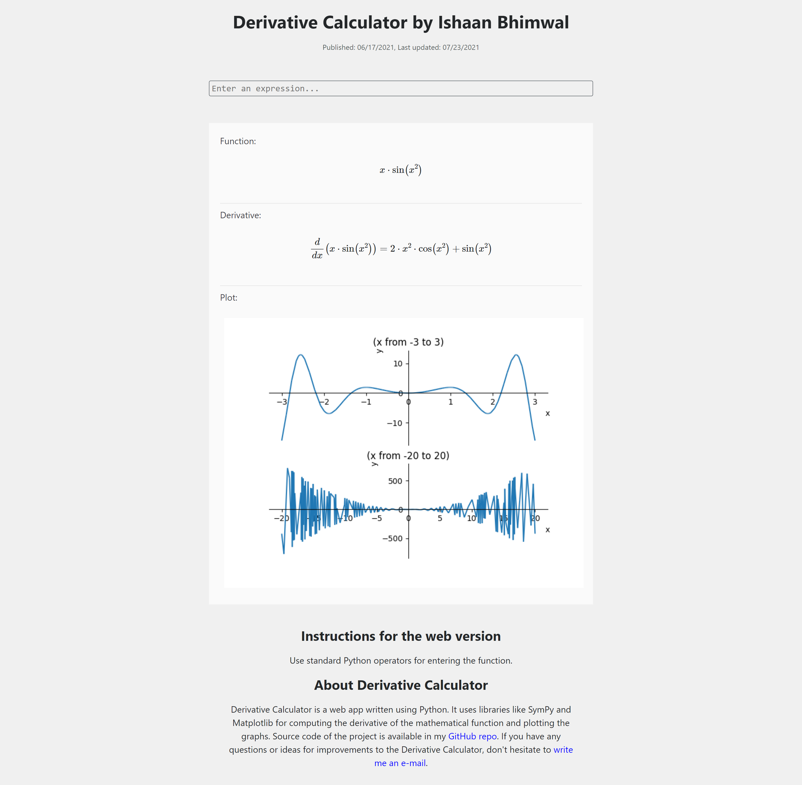

# derivative-calculator-flask.herokuapp.com
[derivative-calculator-flask.herokuapp.com](https://derivative-calculator-flask.herokuapp.com) - source code

Derivative Calculator calculates the symbolic derivative of the given function using `SymPy`. It parses the expression first using recursive descent parsing
and then recusrsively calculates the derivative. It uses `MathJax` to render mathematical expressions written in `AsciiMath`. It uses `Matplotlib` to
plot the graph of the derivative between two different ranges.

The following functions and operators are currently supported

functions: `log`, `ln`, `exp`, `sqrt`, `sin`, `cos`, `tan`, `cot`, `sec`, `csc`, `asin`, `acos`, `atan`, `acot`, `asec`, `acsc`.

operators: `unary and binary + and -`, `^ (exponential)`, 
`* (multiplication)`, `/ (division)` 

All arguments to functions should be enclosed in parenthesis. for example : `sin(x+1), sqrt(x^2)`

## Operator Precedance
0. `log`, `ln`, `exp`, `sqrt`, `sin`, `cos`, `tan`, `cot`, `sec`, `csc`, `asin`, `acos`, `atan`, `acot`, `asec`, `acsc`.
1. `^`
2. `unary + and -`
3. `* and /`
4. `d/dx`
5. `binary + and -`

So, `d/dx a*b` means  `d/dx (a*b)`, but `d/dx a + b` means `(d/dx a) + b`. also `sin(x)^3` means `((sin(x))^3` and not `sin(x^3)`.

## Operator Associativity
1. left associative: `+`, `-`, `*`, `/`
2. right associative: `^`

So, `a*b/c/d` means `((a*b)/c)/d`, and `a^b^c` means `a^(b^c)`.

In case of power of trigonometric functions, input should be provided like `(sin(x))^3`, `sin^3(x)` will not work.

## How to Run
* Install `python` and `pip` if not already installed.
* Install `pipenv` if not already installed by `pip install pipenv`
* git clone the repo
* `cd` to the project folder
* run `pipenv --three` to create a `python3` virtual environment
* run `pipenv install` to install project dependencies
* run `pipenv shell` to activate virtual environment.
* run `python main.py` to run the development server. the server will be accessible now at `http://localhost:5000`
